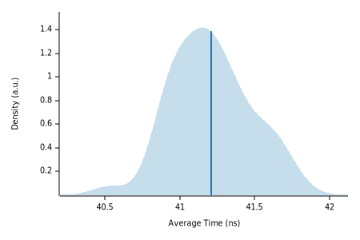

# fastbloom

[](https://docs.rs/fastbloom-rs)
[](https://github.com/yankun1992/fastbloom/actions/workflows/test_rust.yml)
[](https://github.com/yankun1992/fastbloom/actions/workflows/test_python.yml)
[](https://github.com/yankun1992/fastbloom/actions/workflows/benchmark.yml)
[](https://crates.io/crates/fastbloom-rs)
[](https://pypi.org/project/polars/)

A fast bloom filter implemented by Rust for Python!

## setup

### Python

#### requirements

```
Python >= 3.7
```

#### install

Install the latest fastbloom version with:

```bash
pip install fastbloom-rs
```

### Rust

```
fastbloom-rs = "0.1.2"
```

## Examples

### Python

basic usage

```python
from fastbloom_rs import BloomFilter

bloom = BloomFilter(100_000_000, 0.01)

bloom.add_str('hello')
bloom.add_bytes(b'world')
bloom.add_int(9527)

assert bloom.contains('hello')
assert bloom.contains(b'world')
assert bloom.contains(9527)

assert not bloom.contains('hello world')
```

build bloom filter from bytes or list

```python
from fastbloom_rs import BloomFilter

bloom = BloomFilter(100_000_000, 0.01)
bloom.add_str('hello')
assert bloom.contains('hello')

bloom2 = BloomFilter.from_bytes(bloom.get_bytes(), bloom.hashes())
assert bloom2.contains('hello')

bloom3 = BloomFilter.from_int_array(bloom.get_int_array(), bloom.hashes())
assert bloom3.contains('hello')

```

### Rust

```rust
use fastbloom_rs::{BloomFilter, FilterBuilder};

let mut bloom = FilterBuilder::new(100_000_000, 0.01).build_bloom_filter();

bloom.add(b"helloworld");
assert_eq!(bloom.contains(b"helloworld"), true);
assert_eq!(bloom.contains(b"helloworld!"), false);
```

more examples at [docs.rs](https://docs.rs/fastbloom-rs)

## benchmark

### computer info

| CPU                                    | Memory | OS         |
|----------------------------------------|--------|------------|
| AMD Ryzen 7 5800U with Radeon Graphics | 16G    | Windows 10 |

### bloom add

Benchmark insert str to bloom filter:
<div>
  <section class="plots">
    <table width="100%">
      <tbody>
        <tr>
          <td>
            <a href="./docs/img/bloom_add_test/pdf.svg">
              
            </a>
          </td>
          <td>
            <a href="./docs/img/bloom_add_test/regression.svg">
              
            </a>
          </td>
        </tr>
      </tbody>
    </table>
  </section>
  <section class="stats">
    <div class="additional_stats">
      <h4>Additional Statistics:</h4>
      <table>
        <thead>
          <tr>
            <th></th>
            <th title="0.95 confidence level" class="ci-bound">Lower bound</th>
            <th>Estimate</th>
            <th title="0.95 confidence level" class="ci-bound">Upper bound</th>
          </tr>
        </thead>
        <tbody>
          <tr>
            <td>Slope</td>
            <td class="ci-bound">41.095 ns</td>
            <td>41.146 ns</td>
            <td class="ci-bound">41.203 ns</td>
          </tr>
          <tr>
            <td>R&#xb2;</td>
            <td class="ci-bound">0.9959495</td>
            <td>0.9961648</td>
            <td class="ci-bound">0.9959083</td>
          </tr>
          <tr>
            <td>Mean</td>
            <td class="ci-bound">41.157 ns</td>
            <td>41.207 ns</td>
            <td class="ci-bound">41.257 ns</td>
          </tr>
          <tr>
            <td title="Standard Deviation">Std. Dev.</td>
            <td class="ci-bound">226.07 ps</td>
            <td>261.59 ps</td>
            <td class="ci-bound">294.01 ps</td>
          </tr>
          <tr>
            <td>Median</td>
            <td class="ci-bound">41.132 ns</td>
            <td>41.184 ns</td>
            <td class="ci-bound">41.247 ns</td>
          </tr>
          <tr>
            <td title="Median Absolute Deviation">MAD</td>
            <td class="ci-bound">201.13 ps</td>
            <td>277.13 ps</td>
            <td class="ci-bound">335.05 ps</td>
          </tr>
        </tbody>
      </table>
    </div>
  </section>
</div>

### bloom add one million

Benchmark loop insert `(1..1_000_000).map(|n| { n.to_string() })` to bloom filter:
<div>
  <section class="plots">
    <table width="100%">
      <tbody>
        <tr>
          <td>
            <a href="./docs/img/bloom_add_all_test/pdf.svg">
              
            </a>
          </td>
          <td>
            <a href="./docs/img/bloom_add_all_test/iteration_times.svg">
              
            </a>
          </td>
        </tr>
      </tbody>
    </table>
  </section>
  <section class="stats">
    <div class="additional_stats">
      <h4>Additional Statistics:</h4>
      <table>
        <thead>
          <tr>
            <th></th>
            <th title="0.95 confidence level" class="ci-bound">Lower bound</th>
            <th>Estimate</th>
            <th title="0.95 confidence level" class="ci-bound">Upper bound</th>
          </tr>
        </thead>
        <tbody>
          <tr>
            <td>R&#xb2;</td>
            <td class="ci-bound">0.0002895</td>
            <td>0.0002964</td>
            <td class="ci-bound">0.0002822</td>
          </tr>
          <tr>
            <td>Mean</td>
            <td class="ci-bound">237.57 ms</td>
            <td>240.25 ms</td>
            <td class="ci-bound">244.15 ms</td>
          </tr>
          <tr>
            <td title="Standard Deviation">Std. Dev.</td>
            <td class="ci-bound">2.4341 ms</td>
            <td>17.400 ms</td>
            <td class="ci-bound">28.072 ms</td>
          </tr>
          <tr>
            <td>Median</td>
            <td class="ci-bound">236.83 ms</td>
            <td>237.27 ms</td>
            <td class="ci-bound">237.75 ms</td>
          </tr>
          <tr>
            <td title="Median Absolute Deviation">MAD</td>
            <td class="ci-bound">1.5867 ms</td>
            <td>2.2701 ms</td>
            <td class="ci-bound">2.8268 ms</td>
          </tr>
        </tbody>
      </table>
    </div>
  </section>
</div>
